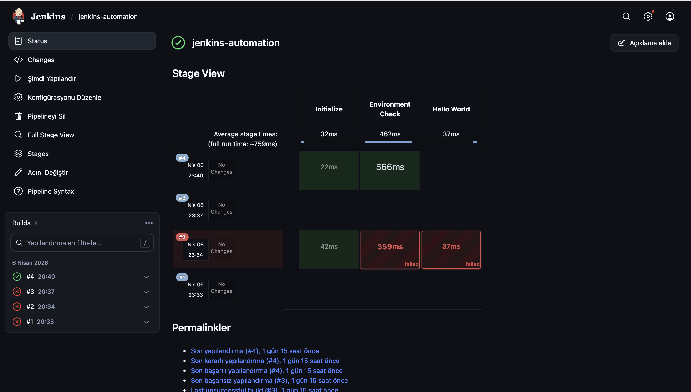
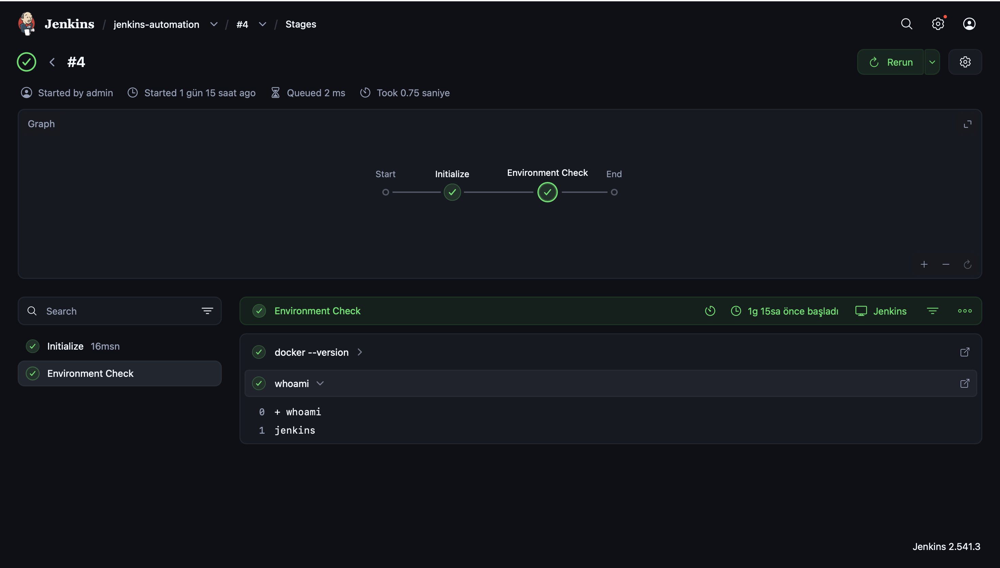
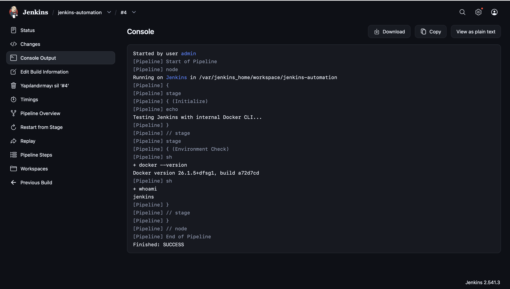

# 🚀 Jenkins Automation Pipeline
This project demonstrates a professional CI/CD Pipeline implementation using Jenkins as the core automation engine. It bridges the gap between application development and containerization by automating the lifecycle of a Node.js application through a managed Jenkins environment.

## 🛠️ Tech Stack
* **CI/CD Tool:** Jenkins (LTS)
* **Containerization:** Docker
* **Runtime:** Node.js
* **Scripting:** Groovy (Jenkins Declarative Pipeline)
* **Infrastructure:** Docker-out-of-Docker (DooD)

## 🏗️ Architecture & Workflow
* **Initialize:** Jenkins prepares the workspace and cleans up previous build artifacts to ensure a fresh environment.
* **Environment Check:** A validation stage that ensures the Jenkins Master has the necessary Docker CLI and Node.js runtimes available.
* **Image Build:** Automatically builds a production-ready Docker image using the provided ```Dockerfile``` within the repository.
* **Verification:** Runs the newly built container to verify that the application logic and environment variables are correctly configured.

## 🗒️ Pipeline Visualization

### 1. Pipeline Stage View

 

*The Stage View provides a high-level overview of the sequential execution, illustrating the transition from initial setup to successful environment validation across multiple iterations.*

### 2. Execution Graph & Step Analysis

 

*A detailed visualization of the pipeline graph showing individual step execution times and successful command triggers within the Jenkins environment.*

### 3. Console Output Validation

 

*The final console logs confirming the successful injection of the Docker CLI and the 'Finished: SUCCESS' state, providing definitive proof of the pipeline's integrity.*

## 🚀 How to Run

### 1. Clone the Repo:
```
git clone https://github.com/selin-karaman/jenkins-automation.git
```

### 2. Start Jenkins via Docker:
```
docker run -d -p 8081:8080 -v /var/run/docker.sock:/var/run/docker.sock --name jenkins-automation jenkins/jenkins:lts
```

### 3. Configure Pipeline:

* Create a new Pipeline item in Jenkins.

* Point the pipeline definition to the ```Jenkinsfile``` in this repository.

* Trigger Build Now.

## 🧠 Key Learning Outcomes
Through the development of this Jenkins-centric automation infrastructure, I achieved the following technical milestones:

* **Jenkins-Docker Integration:** Mastered the DooD (Docker-out-of-Docker) methodology by mounting the Docker socket, allowing a containerized Jenkins to manage host-level Docker resources.
* **Declarative Pipeline Mastery:** Developed a robust ```Jenkinsfile``` using Groovy DSL, implementing error handling (exit codes) and stage-based execution logic.
* **Containerized Tooling:** Resolved complex environment issues by manually injecting Docker CLI into the Jenkins Master container, enabling seamless execution of shell-based automation.
* **Troubleshooting & Resolution:** Gained hands-on experience in managing Jenkins plugin dependencies, port mapping conflicts, and Unix socket permissions (```chmod 666 /var/run/docker.sock```)


